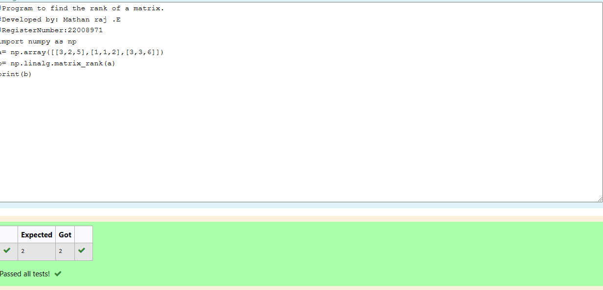

# RANK-OF-A-MATRIX
## Aim:
To write a python program to find the rank of a matrix
## Equipment’s required:
1. 	Hardware – PCs
2. 	Anaconda – Python 3.7 Installation / Moodle-Code Runner
## Algorithm:
### Step 1: import numpy as np
### Step 2: use array function to make the equation in matrix form
### Step 3: Using the np.linalg.matrix_rank(), we can find the rank of the given matrix.
## Program:
```
#Program to find the rank of a matrix.
#Developed by: Mathan raj .E
#RegisterNumber:22008971
import numpy as np
a= np.array([[3,2,5],[1,1,2],[3,3,6]])
b= np.linalg.matrix_rank(a)
print(b)
```
## Output:

## Result:
Thus the rank for the given matrix is successfully solved by  using a python program.

